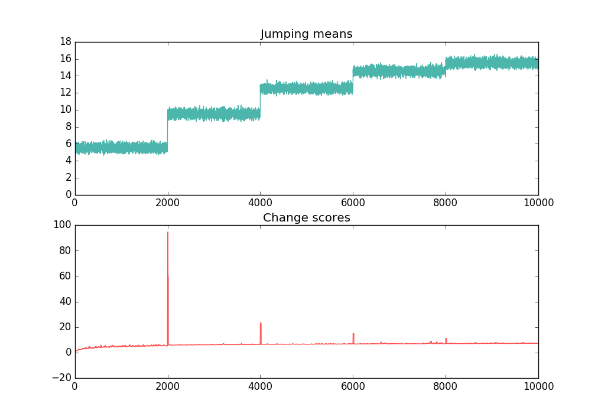

rtchange
========

An implementation of real-time change-point detection in time series.
(See [this paper](http://dl.acm.org/citation.cfm?id=2022866))


## Sample



## Dependencies

The required dependencies to use rtchange are

- Python >= 3.3
- NumPy


## Installtion

```
$ pip install -U rtchange
```


## Example

```python
>>> from rtchange import Finder
>>> f = Finder()
>>> # `score` method returns the iterator of score of the samples.
>>> scores = f.score([0, 0, 0, 0])
<generator object Finder.score at 0x7faa143c4620>
>>> print(list(scores))
[0.0, 0.3938543257165724, 0.42281301105991476, 0.4718002708508469]
>>> print(list(f.score([1, 1])))
[1.0910027829221285, 1.2528868802573792]
>>> # You can also use `score_one` method for the one sample. 
>>> f.score_one(2)
1.4303444070633553
```

## Testing

```
$ pip install -U pip
$ pip install -e .[testing]
$ make
```
